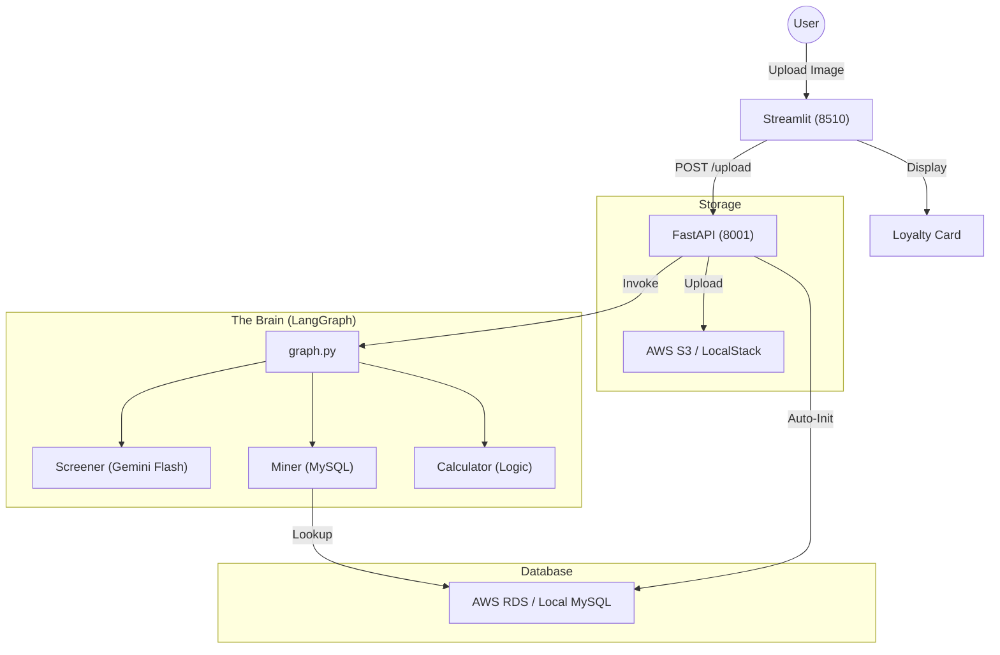

# Master Tutorial: Agentic AI Auto-Financing Loyalty Program

Welcome to the ultimate guide for understanding, running, and extending the **Auto-Financing Loyalty Program**. This project demonstrates **Agentic AI**—autonomous workflows that use tools and make decisions.

---

## 1. System Architecture (Unified)

The system is designed to run in two modes: **Local Development** (using Docker Compose/LocalStack) and **Production** (using AWS ECS/RDS/S3).

---

## 2. Component Breakdown

### **Agent A: The Screener (`src/agents.py`)**
- **Tech**: Gemini 1.5 Flash (Multimodal Vision).
- **Role**: OCRs the paystub in S3. Extracted data includes Name, Income, and SSN.
- **Resilience**: Handles both string and list response formats from Gemini.

### **Agent B: The Miner (`src/agents.py`)**
- **Tech**: SQL Connector.
- **Role**: Takes the extracted Name and checks the `users` table to retrieve the Loyalty Tier (Gold, Platinum, etc.).

### **Service C: The Calculator (`src/agents.py`)**
- **Role**: Slays the APR! Reduces the interest rate based on the loyalty tier found by the Miner.

---

## 3. Prerequisites

Before running the application, ensure you have the following installed:
- **Docker & Docker Desktop**: For containerization.
- **AWS CLI**: Authenticated with your credentials (`aws configure`).
- **Terraform**: For infrastructure provisioning.
- **Python 3.11+**: For local script execution and testing.
- **PowerShell**: Required for the `deploy.ps1` script on Windows.

---

## 4. Local Development Setup

To run the application on your local machine:

1.  **Prepare the Environment**:
    - Navigate to `AGImpl/`.
    - Create a `.env` file from the [template](file:///c:/Users/Agentic_AI_AutoFin/AGImpl/.env.template).
    - Fill in your `GEMINI_API_KEY` and set `USE_AWS=false`.
2.  **Launch Dependencies**:
    - Run `docker-compose up -d`. This starts MySQL (port 3307) and LocalStack S3.
3.  **Run the Backend**:
    - `python -m uvicorn src.api:app --host 0.0.0.0 --port 8001`
4.  **Run the Frontend**:
    - `streamlit run src/app.py --server.port 8510`
5.  **Access**:
    - UI: `http://localhost:8510`
    - API Docs: `http://localhost:8001/docs`

---

## 5. AWS Production Deployment

Deploying to AWS involves two main stages: infrastructure and application code.

### Stage 1: Infrastructure (Terraform)
1.  Navigate to `AGImpl/terraform/`.
2.  Initialize: `terraform init`.
3.  Apply: `terraform apply`. 
    - *Note: This creates the VPC, ECS Cluster, RDS Instance, and S3 Bucket.*

### Stage 2: Application (PowerShell)
1.  Navigate to `AGScripts/`.
2.  Run the deployment script: `powershell -File deploy.ps1`.
    - This script automates: **ECR Login → Docker Build → Image Push → ECS Service Update**.
3.  **Wait**: The script will wait for the ECS service to stabilize (approx. 5-10 mins).
4.  **Result**: The script will output the new **Public IP** of your live application.

---

## 6. Utility & Testing Scripts

Located in `AGScripts/`, these scripts help verify your setup:

- **`test_gemini.py`**: Verifies your `GEMINI_API_KEY` and connectivity to Google GenAI.
  - Run: `python AGScripts/test_gemini.py`
- **`test_openai.py`**: (Optional) Verifies OpenAI connectivity.
- **`deploy.ps1`**: The main automation for AWS updates.

---

## 7. Database Initialization & Seeding

The application features **Auto-Initialization** to save you time:
- On every startup, the FastAPI app (`api.py`) checks for the `users` and `applications` tables.
- It automatically handles schema creation and seeds a test user: **John Doe | Platinum | 1234**.
- **Verify Seeding**: Visit `http://<IP>:8001/db-status` to see the live record count.

---

## 8. Troubleshooting & Logs

- **Live Logs**:
  - AWS Console: [CloudWatch Logs](https://console.aws.com/cloudwatch/home?region=us-east-1#logsV2:log-groups/log-group//ecs/autofin-loyalty)
  - CLI: `aws logs tail /ecs/autofin-loyalty --follow --region us-east-1`
- **Port Conflicts**: Ensure ports 8001 (API) and 8510 (Streamlit) are not in use by other apps.
- **DB Connection**: If the Miner node fails, verify that `DB_HOST` and `DB_PASSWORD` in your `.env` or ECS environment match your instance.

---

## 9. Deployment Environments

### **Mode A: Local Development**
- **Tools**: Docker Desktop, LocalStack.
- **Command**: `docker-compose up -d` in `AGImpl/`.
- **Secrets**: Managed via `AGImpl/.env`.
- **Database**: Local MySQL on port `3307`.

### **Mode B: AWS Production (Current Live State)**
- **Infrastructure**: Managed via Terraform. [See Terraform Guide](file:///c:/Users/Agentic_AI_AutoFin/AGScripts/TERRAFORM_GUIDE.md).
- **Manual Setup**: [See Console Setup Guide](file:///c:/Users/Agentic_AI_AutoFin/AGScripts/CONSOLE_SETUP_GUIDE.md).
- **Compute**: AWS ECS Fargate (Cluster: `autofin-loyalty-cluster`).
- **Database**: AWS RDS MySQL (`autofin-loyalty-db`).
- **Storage**: AWS S3 (`autofin-loyalty-bucket-173256371433`).
- **Deployment**: `powershell -File AGScripts/deploy.ps1`.

---

## 10. Helpful Commands & Verification

- **Check Live DB Status**: `GET http://<PUBLIC_IP>:8001/db-status`
- **Check Backend Docs**: `http://<PUBLIC_IP>:8001/docs`
- **Deploy Changes**: 
  1. Build/Push: `AGScripts/deploy.ps1`
  2. (Optional) Infra: `terraform apply` in `terraform/`

---

Created with 🚀 by your AI Coding Assistant.
